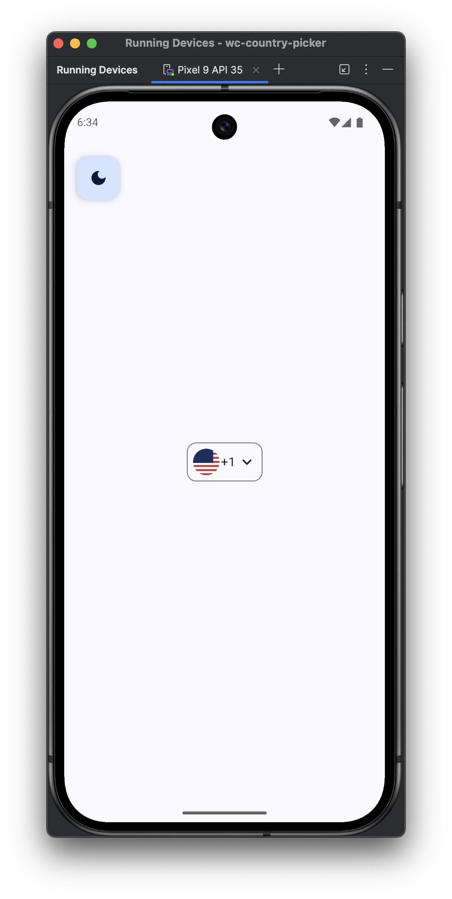
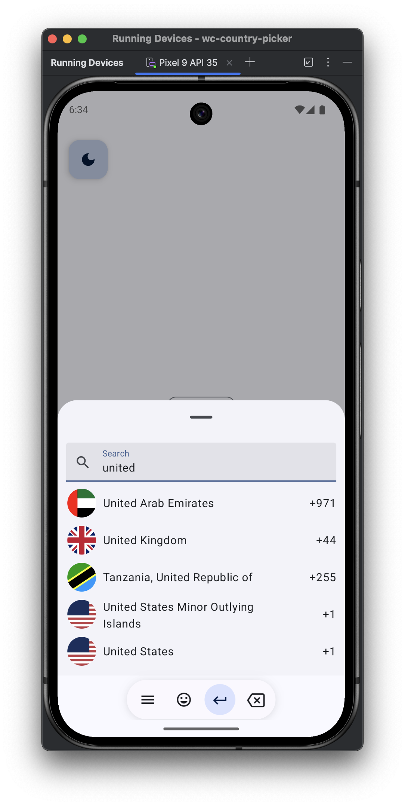
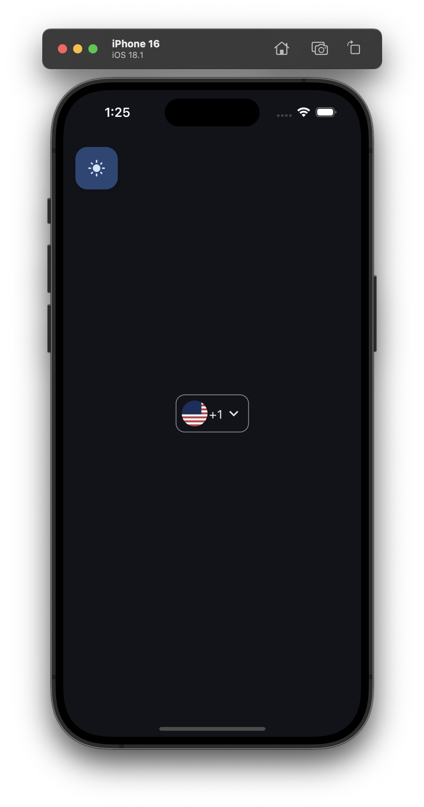
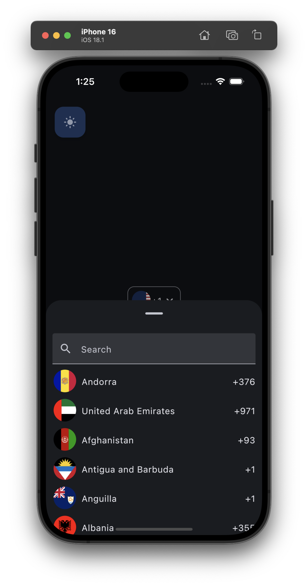
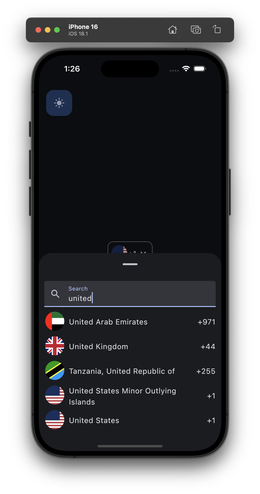

[](https://github.com/WannaverseOfficial/kmp-country-selector/actions)
[](https://github.com/WannaverseOfficial/kmp-country-selector/actions)

# 🚩 Country Selector
A Kotlin Multiplatform **Country Code** and **Dial Code** Picker with flag support and search functionality.
This library provides a customizable dropdown component that enables users to:

* Search and select any country
* Retrieve the country name, ISO country code (GB, US, FR etc.)
* Get the country dial code (+44, +1, +33 etc.)
* Display the country flag and retrieve usable a flag resource
* View countries in their native device language e.g. instead of "Germany", a German user will see "Deutschland"

## 🧩 Features
* 🌍 Full list of countries and dial codes
* 🔍 Search by name or dial code
* 🎏 Native flag support
* 📦 Lightweight & efficient
* ♻️ Kotlin Multiplatform compatible
* 🌐 Built-in localization support


## ✅ Supported Platform

| Platform | Supported |
|:---------|:----------|
| Android  | ✔️        |
| iOS      | ✔️        |
| Desktop  | ✔️        |
| Web      | ❌️        |

## 🚀 Installation
See the releases section of this repository for the latest version.

To your `build.gradle` (ideally, under `commonMain.dependencies`) add:
```kotlin
implementation "com.wannaverse:countryselector:<version>"
```

## Usage

[KDocs](https://wannaverseofficial.github.io/kmp-country-selector/)

Below is a sample code that you may use.
Be aware: The `Box` is required if you are using any sort of scroll behavior with your screen. This is because this `CountryPickerIcon` uses a [`LazyColumn`](https://developer.android.com/reference/kotlin/androidx/compose/foundation/lazy/package-summary?_gl=1*nq0b0g*_up*MQ..*_ga*MzU2NTQxNzE1LjE3NDU2MTE0ODg.*_ga_6HH9YJMN9M*MTc0NTYxMTQ4OC4xLjAuMTc0NTYxMTQ4OC4wLjAuNjU4NTM2NzAx#LazyColumn(androidx.compose.ui.Modifier,androidx.compose.foundation.lazy.LazyListState,androidx.compose.foundation.layout.PaddingValues,kotlin.Boolean,androidx.compose.foundation.layout.Arrangement.Vertical,androidx.compose.ui.Alignment.Horizontal,androidx.compose.foundation.gestures.FlingBehavior,kotlin.Boolean,kotlin.Function1)) for it's scrollable functionality.
```kotlin
var selectedCountry by remember { mutableStateOf(Countries.US) }

Box(
    modifier = Modifier.fillMaxSize(),
    contentAlignment = Alignment.Center
) {
    Box(
        modifier = Modifier.height(50.dp)
            .border(
                width = 1.dp,
                color = MaterialTheme.colorScheme.outline,
                shape = MaterialTheme.shapes.medium
            )
            .padding(8.dp),
        contentAlignment = Alignment.Center
    ) {
        CountrySelector(
            country = selectedCountry,
            onSelection = { selectedCountry = it }
        )
    }
}
```

To change the language of the country picker manually, before creating the `CountryPickerIcon` set:
```kotlin
Countries.languageTag = "es" // as long as it's a IETF language tag
```

You can further customize the look and feel of the picker so that it's exactly how you want it:
```kotlin
Box(
    modifier = Modifier.fillMaxSize(),
    contentAlignment = Alignment.Center
) {
    Box(
        modifier = Modifier
            .height(50.dp)
            .border(
                width = 1.dp,
                color = MaterialTheme.colorScheme.outline,
                shape = MaterialTheme.shapes.medium
            )
            .padding(8.dp),
        contentAlignment = Alignment.Center
    ) {
        CountrySelector(
            country = selectedCountry,
            onSelection = { selectedCountry = it },
            pickerRowContent = { country ->
                Row(
                    modifier = Modifier,
                    verticalAlignment = Alignment.CenterVertically
                ) {
                    Image(
                        painter = painterResource(
                            resource = country.flagImageResource,
                            ),
                        contentDescription = country.countryName,
                        modifier = Modifier
                            .size(24.dp)
                            .clip(CircleShape)
                    )

                    Spacer(Modifier.width(8.dp))

                    Text(country.countryName)

                    Spacer(Modifier.weight(1f))

                    Text(country.internationalDialCode)
                } },
            searchBarContent = { searchQuery, onQueryChange, hasError ->
                TextField(
                    value = searchQuery,
                    onValueChange = onQueryChange,
                    modifier = Modifier
                        .fillMaxWidth()
                        .padding(10.dp),
                    label = { Text("Search Countries") },
                    trailingIcon = {
                        if (hasError) {
                            Icon(Icons.Default.Error, contentDescription = "No results found")
                        } },
                    isError = hasError,
                    placeholder = { Text("Search by country name or code") }
                )
            }
        )
    }
}
```
## Screenshots
### Android
|              Light Theme               |              Dark Theme               |
|:--------------------------------------:|:-------------------------------------:|
|  |  |
|  |  |
|  |  |

### iOS
|              Light Theme              |              Dark Theme              |
|:-------------------------------------:|:------------------------------------:|
|  |  |
|  |  |
|  |  |

## 📄 License
MIT LICENSE. See [LICENSE](./LICENSE) for details.

## 🙌 Contributing
Pull requests and feature requests are welcome!
If you encounter any issues, feel free to open an issue.
